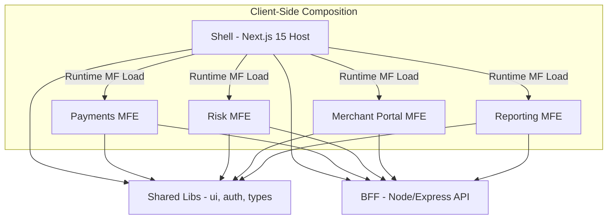

# dLocal Microfrontend Platform

## Tech Stack

| Technology | Version | Notes |
|------------|---------|-------|
| **Next.js** | 15.5.9 | Pages Router (required for Module Federation) |
| **React** | 19.2.3 | Latest React with concurrent features |
| **Module Federation** | 8.8.51 | `@module-federation/nextjs-mf` |
| **Nx** | 22.x | Monorepo orchestration |
| **Node.js** | 20+ | LTS recommended |

## Architecture



> **Note: Client-Side MFE Loading**  
> Remote MFE components are loaded **client-side only** via Module Federation. During server-side rendering, the shell displays skeleton placeholders. After hydration, the actual MFE components are fetched and rendered. This is the recommended pattern for `@module-federation/nextjs-mf` which does not support App Router or server-side remote loading.

## Hybrid Composition Strategy (Build-Time + Runtime)

This platform blends **build-time composition** with **runtime composition**:

- **Build-time composition** happens via shared Nx libraries (`libs/ui`, `libs/auth`, `libs/types`) that are compiled into each app. This keeps core UI and domain contracts consistent across the shell and MFEs.
- **Runtime composition** is powered by **Module Federation**. The shell loads each MFE from its `remoteEntry.js` at runtime, allowing independent deployment and local development while keeping a cohesive UX.

The shell resolves remote URLs via environment variables (e.g. `NEXT_PUBLIC_PAYMENTS_REMOTE_URL`) and loads MFE entry points dynamically using `React.lazy()` with client-side rendering.

## Running Locally

Install dependencies:

```bash
pnpm install
```

Common Nx commands:

```bash
# Build all apps/libs
pnpm build

# Lint all apps/libs
pnpm nx run-many --target=lint
```

### Run Individual Apps

```bash
# Shell (host)
pnpm nx run shell:dev

# MFEs
pnpm nx run payments:dev
pnpm nx run risk:dev
pnpm nx run merchant-portal:dev
pnpm nx run reporting:dev

# BFF API
pnpm nx run bff:serve
```

## Run Shell + MFEs Together (Dev Mode)

Start MFEs, then the shell:

```bash
pnpm nx run-many --target=dev --projects=payments,risk,merchant-portal,reporting --parallel
pnpm nx run shell:dev
```

If the shell needs to call the API layer, run the BFF in a separate terminal:

```bash
pnpm nx run bff:serve
```

> Tip: update `NEXT_PUBLIC_*_REMOTE_URL` variables to point the shell at non-default MFE URLs when needed.

## CI/CD Overview

Typical pipeline stages for this monorepo:

1. **Install** dependencies (`pnpm install`).
2. **Lint/Test** all relevant projects with Nx (`nx run-many --target=lint/test`).
3. **Build** apps (`pnpm build` - includes required `NEXT_PRIVATE_LOCAL_WEBPACK=true`).
4. **Publish artifacts** per app (shell, each MFE, and BFF).
5. **Deploy** shell + MFEs independently to their respective environments, with BFF deployed alongside or as a separate service.

## Gitflow Branch Strategy

We follow a Gitflow-inspired workflow:

- `main` contains production-ready releases.
- `develop` aggregates ongoing feature work.
- `feature/*` branches are created from `develop` and merged back via PRs.
- `release/*` branches are cut from `develop` for stabilization, then merged into `main` and `develop`.
- `hotfix/*` branches are cut from `main` for urgent fixes and merged back into both `main` and `develop`.

## Adding a New MFE and Integrating with the Shell

1. **Generate the app** (Next.js MFE):
   - Must use Page Router with Next.js v15 (App router not supported)

   ```bash
   pnpm nx g @nx/next:app my-mfe
   ```

2. **Convert to Pages Router** (if generated with App Router):
   - Create `apps/my-mfe/src/pages/` directory
   - Add `_app.tsx`, `_document.tsx`, and `index.tsx`
   - Remove the `app/` directory

3. **Enable Module Federation** in the new MFE's `next.config.js`:
   ```js
   const { NextFederationPlugin } = require('@module-federation/nextjs-mf');

   // Only apply on client side
   if (!options.isServer) {
     config.plugins.push(
       new NextFederationPlugin({
         name: 'myMfe',
         filename: 'static/chunks/remoteEntry.js',
         exposes: {
           './RemoteEntry': './src/components/RemoteEntry'
         },
         shared: {
           react: { singleton: true, requiredVersion: false },
           'react-dom': { singleton: true, requiredVersion: false },
           next: { singleton: true, requiredVersion: false }
         }
       })
     );
   }
   ```

4. **Create the Remote Entry component**:
   - Create `apps/my-mfe/src/components/RemoteEntry.tsx` and export the root UI.

5. **Register the remote in the shell**:
   - Add a new env var in `apps/shell/next.config.js` (e.g. `NEXT_PUBLIC_MY_MFE_REMOTE_URL`).
   - Add the remote mapping in `remotes`:
     ```js
     myMfe: `myMfe@${myMfeRemoteUrl}/_next/static/chunks/remoteEntry.js`
     ```

6. **Add typings for the remote**:
   - Update `apps/shell/src/remotes.d.ts`:
     ```ts
     declare module 'myMfe/RemoteEntry' {
       const RemoteEntry: React.ComponentType;
       export default RemoteEntry;
     }
     ```

7. **Render the new MFE in the shell UI**:
   - Add a lazy import in `apps/shell/src/components/MfeWorkspace.tsx`:
     ```ts
     const MyMfeRemote = lazy(() => import(/* webpackIgnore: true */ 'myMfe/RemoteEntry'));
     ```
   - Wrap with `<Suspense>` and render only on client side.

8. **Run in dev**:
   - Start the new MFE dev server, then the shell (or use `nx run-many`).

## Module Federation Configuration Notes

- **`NEXT_PRIVATE_LOCAL_WEBPACK=true`**: Required for Module Federation with Next.js 15. This is set automatically via `cross-env` in the build script.
- **`webpack` dependency**: Must be installed as a direct dependency (not just through Next.js).
- **Client-side only**: Module Federation plugin is only applied for client builds (`!options.isServer`).
- **SSR handling**: The shell renders skeleton placeholders during SSR; MFEs load after hydration.